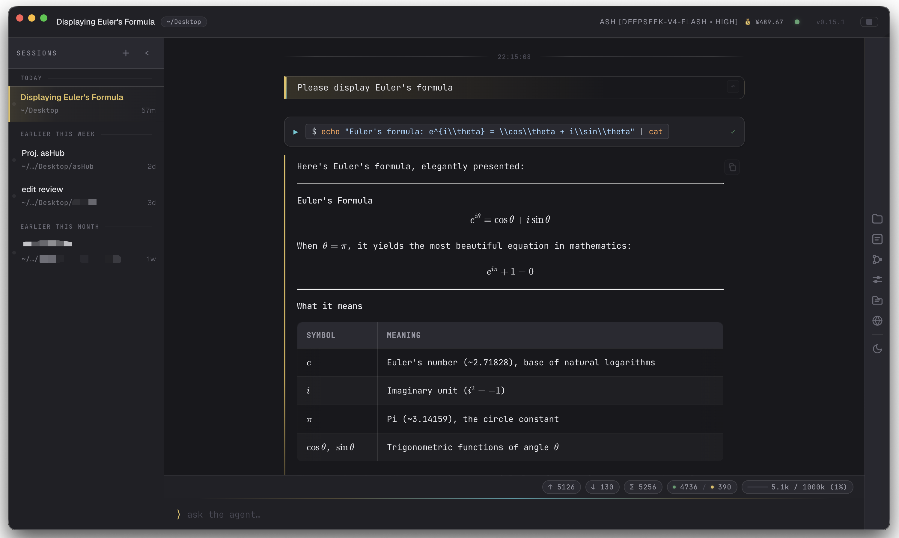

# asHub

[English](#ashub) | [简体中文](README_CN.md)

[](LICENSE)
[](package.json)

Desktop app for [agent-sh](https://github.com/guanyilun/agent-sh) — runs agent-sh sessions and exposes them through a browser UI.



## Features

- **Multi-session** — sidebar to spawn, switch, and close sessions
- **Session persistence** — conversations survive restarts
- **Live streaming** — SSE with Markdown, syntax-highlighted code, diff views, and tool calls
- **Reasoning compaction** — consecutive think→tool rounds auto-collapse into a single expandable block
- **Image support** — paste/upload images for multimodal models (GPT-4o, Claude, Gemini, GLM)
- **Model picker** — searchable dropdown grouped by provider with all configured models
- **Cache hit ratio** — circular progress ring showing prompt cache efficiency
- **DeepSeek balance** — per-session balance display for DeepSeek provider
- **Cross-platform** — packaged for macOS (Apple Silicon), Windows (x64), and Linux (AppImage)

## Install

**macOS (Apple Silicon)** — one-line install, no Gatekeeper prompt:

```sh
curl -fsSL https://raw.githubusercontent.com/firslov/ashub/main/install.sh | bash
```

This grabs the latest release, installs to `/Applications`, and clears the
quarantine flag. asHub is signed ad-hoc but not notarized (no paid Apple
Developer account), so a plain download from the browser would otherwise be
blocked by Gatekeeper.

<details>
<summary>Prefer the .dmg?</summary>

Download it from [Releases](https://github.com/firslov/ashub/releases), drag
asHub to Applications, then either:

- run `/usr/bin/xattr -dr com.apple.quarantine "/Applications/asHub.app"`, **or**
- launch it once, then open **System Settings → Privacy & Security**, scroll to
  the bottom and click **Open Anyway**. (On macOS Sequoia and later the old
  right-click → Open shortcut no longer works.)

</details>

**Windows** — download the installer from
[Releases](https://github.com/firslov/ashub/releases). Requires PowerShell 5.1
or later (built into Windows 10/11).

**Linux** — download the AppImage from
[Releases](https://github.com/firslov/ashub/releases).

## Dev

```sh
npm install
npm run electron:dev        # dev mode
npm run electron:dist:mac   # build macOS .dmg
npm run electron:dist:win   # build Windows .exe
```

## CLI

```sh
ashub                        # default: port 7878
ashub --port 8080
ashub --model gpt-4o
```

| Flag            | Default          | Description             |
|-----------------|------------------|-------------------------|
| `--port N`      | `7878`           | HTTP port               |
| `--host HOST`   | `127.0.0.1`      | Bind host               |
| `--model NAME`  | settings default | Model override          |
| `--provider NAME` | settings default | Provider override     |

## License

MIT
