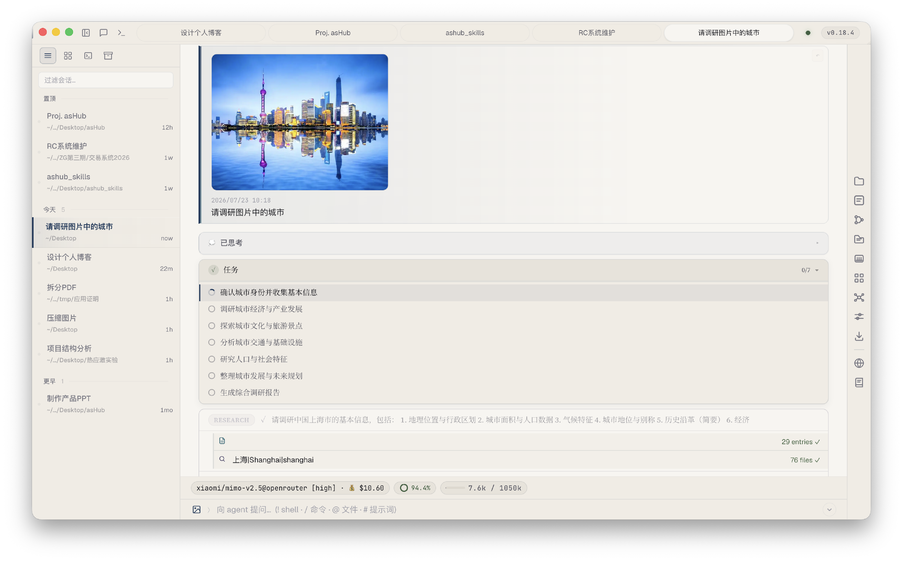

# asHub

[English](#ashub) | [简体中文](README_CN.md)

[](LICENSE)
[](package.json)

Desktop app for [agent-sh](https://github.com/guanyilun/agent-sh) — runs agent-sh sessions and exposes them through a browser UI.



## Features

- **Multi-session** — sidebar to spawn, switch, search, and close sessions
- **Session persistence** — conversations survive restarts
- **Auto-title** — LLM-generated session titles with plain-text fallback
- **Live streaming** — SSE with Markdown, syntax-highlighted code, diff views, and tool calls
- **Reasoning compaction** — consecutive think→tool rounds auto-collapse into a single expandable block
- **Todo list** — agent-managed task tracking, rendered as a progress card that stays pinned atop the stream
- **Subagents** — five specialists (plan / explore / review / research / implement) with permission gating, cancellation, concurrency limits, and per-type model overrides
- **Branch tree** — rewind and fork through conversation history; non-destructive time travel with a visual tree panel
- **Permission gate** — file-modification approvals with countdown, full-diff preview, and session-wide option
- **Export** — one-click export of any conversation to Markdown
- **Skills marketplace** — browse and install skills from GitHub or Gitee
- **System notifications** — get notified when approvals are requested or replies finish in the background
- **Image support** — paste/upload images for multimodal models with automatic compression and Blob URL rendering
- **Model picker** — searchable dropdown with real-time OpenRouter catalog (300+ models) grouped by provider
- **Vision indicator** — icon in the input bar shows when the active model supports images
- **Collapsible status bar** — toggle to hide/show model, cache, and balance info
- **Cache hit ratio** — circular progress ring showing prompt cache efficiency
- **Provider balance** — per-session balance for DeepSeek and OpenRouter
- **Hot reload** — apiKey and provider config changes take effect immediately, no restart needed
- **Streaming perf** — block-level incremental rendering, debounced highlighting, SPA DOM cache
- **Sleep resilience** — auto-pauses SSE on system sleep to prevent wake-up freezes
- **Cross-platform** — packaged for macOS (Apple Silicon), Windows (x64), and Linux (AppImage)

## Install

### macOS (Apple Silicon)

One-line install, no Gatekeeper prompt:

```sh
curl -fsSL https://raw.githubusercontent.com/firslov/ashub/main/install.sh | bash
```

Installs to `/Applications` and clears the quarantine flag.

<details>
<summary>Prefer the .dmg?</summary>

Download from [Releases](https://github.com/firslov/ashub/releases), drag to Applications, then:

- run `/usr/bin/xattr -dr com.apple.quarantine "/Applications/asHub.app"`, **or**
- launch once, then open **System Settings → Privacy & Security**, scroll to the bottom and click **Open Anyway**.

</details>

### Windows

Download the installer from [Releases](https://github.com/firslov/ashub/releases). Requires PowerShell 5.1+ (built into Windows 10/11).

### Linux

Download the AppImage from [Releases](https://github.com/firslov/ashub/releases).

### Run from source

Requires **Node.js ≥ 20.3**.

```sh
git clone https://github.com/firslov/ashub.git
cd ashub
npm install
```

**Electron** (desktop app):

```sh
npm run electron:dev
```

**Headless** (CLI server, no window):

```sh
npm start -- --port 8080
```

**Browser** (use any modern browser as the UI):

```sh
npm start -- --host 0.0.0.0 --port 7878
# then open http://localhost:7878
```

> Bind `0.0.0.0` to allow access from other devices on your network.
> Use `127.0.0.1` (default) for local-only access.

**Build** a distributable package:

```sh
npm run electron:dist:mac   # macOS .dmg
npm run electron:dist:win   # Windows .exe
```

#### CLI flags

| Flag | Default | Description |
|---|---|---|
| `--port N` | `7878` | HTTP port |
| `--host HOST` | `127.0.0.1` | Bind address |
| `--model NAME` | settings default | Model override |
| `--provider NAME` | settings default | Provider override |

## License

MIT
