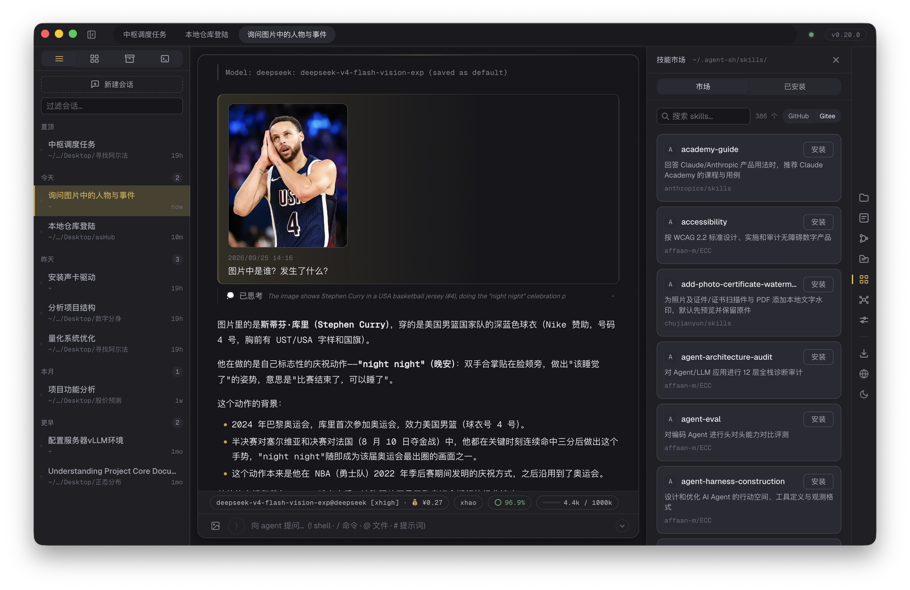

# asHub

[English](README.md) | [简体中文](#ashub)

[](LICENSE)
[](package.json)

[agent-sh](https://github.com/guanyilun/agent-sh) 的桌面应用 —— 它负责创建并监管 agent-sh 会话，
并通过单一端口把它们暴露给浏览器界面。



桌面窗口和普通浏览器是**同一个客户端**：Electron 内嵌了下面这个 hub，所以在任意浏览器里打开
`http://localhost:7878`，看到的内容与桌面窗口完全一致。

## 功能特性

- **多会话** —— 侧边栏可创建、切换、搜索、置顶、归档、关闭会话
- **工作区视图** —— 按工作目录分组展示会话，终端与归档各自独立成视图
- **终端会话** —— 真正的 PTY shell 与 agent 会话并存，以标签页方式切换
- **会话持久化** —— 重启后对话依然保留
- **自动标题** —— LLM 生成会话标题，纯文本回退兜底
- **实时流式输出** —— SSE 支持 Markdown、语法高亮代码、Diff 视图和工具调用
- **推理过程折叠** —— 连续的 think→tool 轮次自动折叠为可展开的单一块
- **任务清单** —— agent 自动维护任务追踪，渲染为吸附在消息流顶部的进度卡片
- **子代理** —— 五种专家子代理（plan / explore / review / research / implement），支持权限审批、取消、并发限制、按类型模型覆盖与预算
- **分支树** —— rewind 与 fork 自由穿梭对话历史，非破坏性时间旅行，可视化树形面板
- **权限审批** —— 文件修改审批（倒计时、完整 diff 预览、会话级放行）
- **导出** —— 一键导出对话为 Markdown
- **技能市场** —— 从 GitHub / Gitee 浏览安装技能
- **扩展机制** —— 从 `~/.agent-sh/extensions` 加载用户扩展，示例见 [`examples/extensions`](examples/extensions)
- **系统通知** —— 后台运行时通知审批请求与回复完成
- **图片支持** —— 多模态模型支持粘贴/上传图片，自动压缩并使用 Blob URL 渲染
- **模型选择器** —— 按 provider 分组、可搜索的下拉列表，实时同步 OpenRouter 目录（300+ 模型）
- **多模态指示器** —— 输入框左侧图标标识当前模型是否支持图片
- **状态栏折叠** —— 一键隐藏/显示模型、缓存、余额信息
- **缓存命中率** —— 圆形进度环展示 prompt cache 命中效率
- **Provider 余额** —— 按会话独立显示 DeepSeek、OpenRouter 余额
- **热重载** —— apiKey 和 provider 配置修改后立即生效，无需重启
- **流式性能优化** —— block 级增量渲染、防抖语法高亮、SPA DOM 缓存
- **休眠保护** —— 系统休眠时自动暂停 SSE 与渲染
- **自动更新** —— 应用内更新走镜像下载，镜像不可用时回退 GitHub
- **双语界面** —— 简体中文与 English，另有显示缩放设置
- **跨平台** —— 已打包支持 macOS（Apple Silicon 与 Intel）、Windows (x64) 和 Linux (AppImage)

## 工作原理

`src/hub.ts` 是核心：一个**与后端无关**的 HTTP + SSE 服务，为每个会话创建并监管一个 *bridge*。
负责对话的那一端只需发出 `BusEvent` 并实现 `submit` / `cancel` / `close` —— 接口定义见
[`src/bridges/types.ts`](src/bridges/types.ts)。

```
Electron 外壳 (electron/main.cjs)           浏览器（任意现代浏览器）
        │                                             │
        └──────────────► hub (src/hub.ts) ◄───────────┘
                     单一 HTTP 端口，路径路由 /<id>/events、/<id>/submit
                                 │
        ┌────────────────────────┼────────────────────────┐
        ▼                        ▼                        ▼
   AshBridge               AcpBridge               TerminalBridge
   进程内 agent-sh 内核     子进程（ACP 协议）        PTY shell（node-pty）
```

| Bridge | 运行内容 | 选择方式 |
|---|---|---|
| `AshBridge` | 进程内直接跑 agent-sh 内核，无子进程，少一跳 | 默认（`--backend ash`） |
| `AcpBridge` | 说 ACP 协议的子进程，如 `agent-sh-acp`、`claude-code-acp` | `--backend acp [--cmd "CMD ARGS"]` |
| `TerminalBridge` | PTY shell 会话（agent-sh 的 shell 或普通终端） | 会话类型 `terminal` |

因此新增一种后端只需要实现一个接口，hub、SSE 协议与前端都不用改。

## 安装

### macOS（Apple Silicon 与 Intel）

一行命令安装，无需处理 Gatekeeper 拦截：

```sh
curl -fsSL https://raw.githubusercontent.com/firslov/ashub/main/install.sh | bash
```

安装到 `/Applications` 并清除隔离标记。`install.sh` 会自动识别 `arm64` / `x86_64` 并取对应构建。

<details>
<summary>想用 .dmg 安装？</summary>

从 [Releases](https://github.com/firslov/ashub/releases) 下载，拖入 Applications，然后：

- 执行 `/usr/bin/xattr -dr com.apple.quarantine "/Applications/asHub.app"`，**或**
- 先打开一次，进入 **系统设置 → 隐私与安全性**，拉到底部点击 **仍要打开**。

</details>

### Windows

从 [Releases](https://github.com/firslov/ashub/releases) 下载安装包。
终端会话使用系统 shell（`%COMSPEC%`，或 PowerShell）。

### Linux

从 [Releases](https://github.com/firslov/ashub/releases) 下载 AppImage。

下载同样由项目自己的镜像提供（见 [下载与镜像](#下载与镜像)），一行命令安装脚本与应用内更新默认都走它。

## 源码运行

需要 **Node.js ≥ 20.3**。

```sh
git clone https://github.com/firslov/ashub.git
cd ashub
npm install
```

**Electron**（桌面应用）：

```sh
npm run electron:dev
```

**命令行**（无窗口服务器）：

```sh
npm start -- --port 8080
```

**浏览器**（用任意浏览器作为界面）：

```sh
npm start -- --host 0.0.0.0 --port 7878
# 在浏览器中打开 http://localhost:7878
```

> 绑定 `0.0.0.0` 允许局域网内其他设备访问。
> `127.0.0.1`（默认）仅限本机访问。

**构建**可分发的安装包：

```sh
npm run electron:dist:mac   # macOS .dmg（arm64 + x64）
npm run electron:dist:win   # Windows .exe（NSIS）
```

## 命令行参数

以下参数适用于 `ashub` / `npm start`；Electron 应用以默认值在进程内启动同一个 hub。

| 参数 | 默认值 | 说明 |
|---|---|---|
| `--backend ash\|acp` | `ash` | 桥接实现：进程内 agent-sh 内核，或 ACP 子进程 |
| `--cmd "CMD ARGS"` | `agent-sh-acp` | `--backend acp` 时启动的子进程命令（支持双引号） |
| `--port N` | `7878` | HTTP 端口 |
| `--host HOST` | `127.0.0.1` | 绑定地址 |
| `--web PATH` | `./web` | 静态资源根目录 |
| `--model NAME` | 配置默认值 | 覆盖模型（ash 后端） |
| `--provider NAME` | 配置默认值 | 覆盖 Provider（ash 后端） |
| `-h`, `--help` | — | 显示帮助 |

```sh
# 进程内内核（默认）
ashub --port 8080

# 改为拉起 Claude Code 的 ACP 服务
ashub --backend acp --cmd "claude-code-acp"
```

## HTTP 接口

前端通过普通 HTTP 与 hub 通信，同一套接口也可供脚本调用。会话级路由以 `POST /sessions`
返回的 `instanceId` 作为前缀。

| 方法 | 路径 | 用途 |
|---|---|---|
| `GET` | `/sessions` | 当前会话列表（JSON：cwd、标题、类型、模型、状态） |
| `POST` | `/sessions` | 新建会话 —— `{ cwd?, kind? }` → `{ instanceId, cwd, kind }` |
| `DELETE` | `/<id>/` | 关闭会话 |
| `GET` | `/<id>/` | 该会话的网页界面 |
| `GET` | `/<id>/events` | SSE 事件流（消息、工具调用、任务清单、审批、PTY 输出） |
| `POST` | `/<id>/submit` | 提交提问 —— `{ query }` |
| `POST` | `/<id>/cancel` | 取消当前回合 |
| `POST` | `/<id>/pty-input`、`/<id>/pty-resize` | 终端会话的输入与尺寸 |
| `GET`/`POST` | `/<id>/context`、`/context/rewind`、`/context/drop` | 查看与回退上下文 |
| `GET`/`POST` | `/<id>/tree`、`/<id>/fork` | 分支树与非破坏性 fork |
| `GET`/`PUT` | `/<id>/model`、`/sa-model`、`/sa-budget`、`/sa-types` | 模型与子代理设置 |
| `POST` | `/api/permission/decide` | 回应权限审批 |
| `POST` | `/api/upload`、`GET /api/uploads/<id>` | 图片附件 |
| `GET` | `/api/models`、`/api/balance`、`/api/version` | 模型目录、Provider 余额、版本 |
| `GET`/`PUT`/`POST` | `/api/config`、`/api/config/reload`、`/api/settings/auto-approve` | 配置项 |
| `GET`/`POST` | `/api/skills`、`/api/skills/install`、`/api/skills/uninstall` | 技能市场 |
| `GET` | `/fs`、`/<id>/files`、`/pick-dir` | 界面用的文件浏览 |

## 目录结构

```
src/
  cli.ts              入口：参数解析、桥接工厂、启动 hub
  hub.ts              单端口 HTTP/SSE 服务：会话、路由、权限、上传
  bridges/
    types.ts          所有后端都实现的 Bridge 接口
    ash.ts            进程内 agent-sh 内核
    acp.ts            ACP 子进程与消息翻译
    terminal.ts       PTY shell 会话
  history/            会话存储、帧捕获、摘要、压缩策略
web/                  前端：原生 ES 模块，无构建步骤（index.html + js/ + css/）
  js/stream/          各类消息块的渲染器（思考、工具、任务清单、回复、实时输出）
electron/             桌面外壳：窗口、菜单、IPC、自动更新、面向扩展的 tsx 加载
mirror/               下载镜像与落地页，服务于 ashub.aihao.world
examples/extensions/  agent-sh 扩展示例（wechat-bot）
scripts/              构建辅助（依赖校验、Windows 资源、release JSON）
```

## 开发

| 命令 | 作用 |
|---|---|
| `npm start` | 用 `tsx` 直接从 TypeScript 运行 hub（无需构建） |
| `npm run build` | 用 `tsc` 把 `src/` 编译到 `dist/` |
| `npm run typecheck` | 类型检查 `src/`（`tsc --noEmit`） |
| `npm run typecheck:web` | 按 `web/jsconfig.json` 检查 `web/js` |
| `npm run electron:dev` | 先构建，再启动 Electron（它加载的是 `dist/`） |
| `npm run electron:pack` | 生成解包后的应用目录，便于本地快速验证 |
| `npm run electron:dist:mac` / `:win` | 生成可分发包 |

几点说明：

- `web/` **没有构建步骤** —— 原生 ES 模块与 CSS 直接加载。所有第三方前端库（marked、DOMPurify、
  highlight.js、KaTeX、xterm）都放在 `web/vendor`，因此界面可离线工作。
- Electron 加载的是编译产物 `dist/`，所以 `electron:dev` 会先跑 `build`；而 CLI 通过 `tsx`
  直接运行 `src/` 里的同一份代码。
- `prebuild` 会执行 `scripts/check-deps.cjs`：当 `git pull` 后 `node_modules` 过期时，
  在 `tsc` 报出误导性错误之前先给出真实原因。
- 类型检查是分开的：`src` 是严格 TypeScript，`web/js` 以 `checkJs: false` 检查
  （见 `web/jsconfig.json`）。

## 技能与扩展

- **技能**：通过侧边栏的技能面板，从内置市场（GitHub 或 Gitee 源）安装到 agent-sh 的技能目录。
- **扩展**：ash 后端从 `~/.agent-sh/extensions/` 加载，并注册了 `tsx`，因此扩展可以用
  TypeScript 编写。[`examples/extensions/wechat-bot`](examples/extensions/wechat-bot)
  是一个完整示例：把消息转发到本地 webhook 的工具。

## 下载与镜像

发布产物由 GitHub Actions 构建（macOS arm64 + x64、Windows x64、Linux x64），并同步到
[`mirror/`](mirror/README.md) 里那个零依赖的小服务。它同时承担两件事：

- **`mirror.aihao.world`** —— 面向 `electron-updater` 与手动下载的发布代理，会把二进制
  地址改写到 CDN，避免大文件走 VPS 慢链路。
- **`ashub.aihao.world`** —— 下载落地页，服务端渲染并注入当前版本号。

macOS 一行安装脚本与应用内更新都优先走镜像，镜像不可达时回退 GitHub。

## 许可证

MIT
