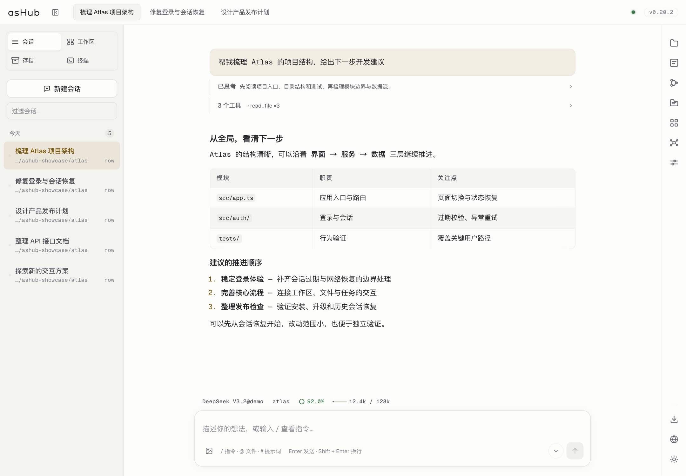
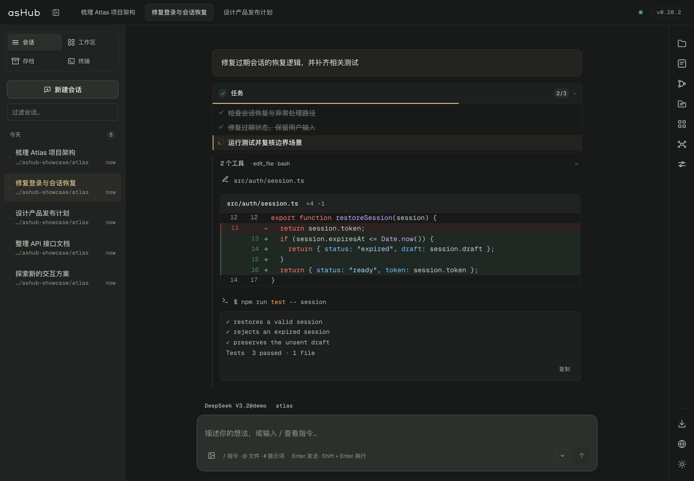
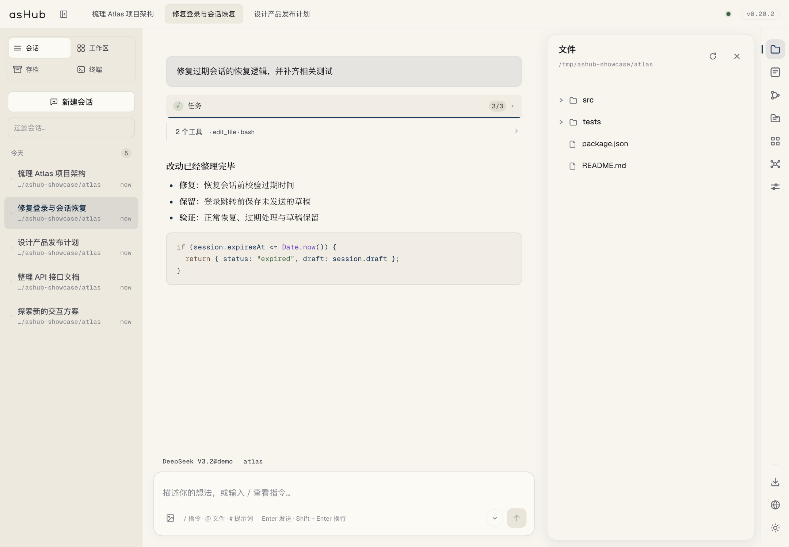

<p align="center"></p>
<h1 align="center">asHub</h1>
<p align="center">让想法成形，让复杂有序</p>
<p align="center"><a href="https://ashub.aihao.world">主页与下载</a> · <a href="https://github.com/firslov/asHub/releases">Releases</a> · <a href="README.md">English</a> · <a href="README_CN.md">简体中文</a></p>

[](LICENSE)
[](.nvmrc)
[](package.json)

asHub 是基于 [agent-sh](https://github.com/guanyilun/agent-sh) 的开源桌面 AI Agent 工作台。把多会话、模型选择、子代理、终端和文件放在同一个界面，既能专注阅读结果，也能展开审阅完整执行过程。

支持 **macOS（Apple Silicon / Intel）、Windows x64 与 Linux x64**。桌面版与浏览器版使用同一套客户端；使用前需配置自己的模型提供商与 API 凭据，模型调用费用由提供商收取。



*配图来自 v0.20.2 的真实界面，使用隔离的演示项目与示例对话，不包含个人会话或 API 凭据。*

## 核心体验

| 能力 | 使用体验 |
| --- | --- |
| 多会话与工作区 | 标签切换，按工作目录组织，搜索、置顶、归档与历史恢复 |
| 清晰的执行过程 | Markdown、代码高亮、Diff、思考与工具调用分层展示；详情可展开，输出可复制 |
| 任务与子代理 | 任务清单与进度；规划、探索、审查、调研、实现五类子代理，支持模型与预算配置 |
| 模型与上下文 | 搜索与切换模型，查看上下文用量、缓存命中率，以及支持的提供商余额 |
| 可审阅的操作 | 权限审批、改动预览、会话级放行；后台完成与审批通知 |
| 项目工具 | PTY 终端、文件浏览、图片输入、技能市场、用户扩展 |
| 保留工作脉络 | 会话持久化、对话分支与回退、Markdown 导出 |
| 统一的界面 | 浅色、深色与暖白主题，中英文切换、显示缩放、可折叠状态栏 |

<details>
<summary>查看执行过程：任务、代码差异与工具输出</summary>



</details>

<details>
<summary>查看文件侧栏与暖白主题</summary>



</details>

## 安装与开始使用

从 [主页](https://ashub.aihao.world/#download) 或 [GitHub Releases](https://github.com/firslov/asHub/releases/latest) 下载。桌面安装包包含运行环境，无需单独安装 Node.js。

| 系统 | 安装包 |
| --- | --- |
| macOS Apple Silicon | `arm64.dmg` |
| macOS Intel | `x64.dmg` |
| Windows x64 | `Setup.exe` |
| Linux x64 | `.AppImage` |

1. 安装并打开 asHub
2. 在右侧配置面板设置模型提供商、API 凭据与默认模型
3. 新建会话，选择项目目录，开始对话；需要时打开文件、终端或其他辅助面板

### macOS 一行安装

```sh
curl -fsSL https://raw.githubusercontent.com/firslov/asHub/main/install.sh | bash
```

脚本识别 Apple Silicon / Intel，将应用安装到 `/Applications` 并清除隔离标记。手动安装 DMG 如被拦截，可在「系统设置 → 隐私与安全性」中选择「仍要打开」，或执行：

```sh
/usr/bin/xattr -dr com.apple.quarantine "/Applications/asHub.app"
```

### Linux

下载 AppImage 后，在文件所在目录执行：

```sh
chmod +x ./asHub-*.AppImage
./asHub-*.AppImage
```

## 从源码运行

项目固定使用 **Node.js 22.23.3**（最低 **22.12.0**），内核为 **agent-sh 0.15.17**。使用 nvm 时：

```sh
git clone https://github.com/firslov/asHub.git
cd asHub
nvm install && nvm use
npm ci
npm run electron:dev
```

只运行本地 Web 服务：

```sh
npm start -- --port 7878
# 浏览器打开 http://localhost:7878
```

### 跨设备访问

```sh
npm start -- --host 0.0.0.0 --port 7878
```

默认仅监听 `127.0.0.1`。非回环地址需要访问令牌：启动时终端会显示自动生成的令牌，在浏览器 `/auth` 页面登录。也可通过 `ASHUB_TOKEN` 设置固定令牌；API 客户端使用 `Authorization: Bearer <令牌>`。跨设备连接请使用可信网络或 HTTPS 反向代理。

会话历史保存在本地；使用云端模型时，相关请求内容会发送给配置的提供商。ACP 会话恢复依赖后端的 `session/load`：不支持恢复或旧会话缺少远端 ID 时，历史仍可查看，但需新建会话继续。

## 工作原理

`src/hub.ts` 是核心：一个**与后端无关**的 HTTP + SSE 服务，为每个会话创建并监管一个 *bridge*。
负责对话的那一端只需发出 `BusEvent` 并实现 `submit` / `cancel` / `close` —— 接口定义见
[`src/bridges/types.ts`](src/bridges/types.ts)。

```
Electron 外壳 (electron/main.cjs)           浏览器（任意现代浏览器）
        │                                             │
        └──────────────► hub (src/hub.ts) ◄───────────┘
                     单一 HTTP 端口，路径路由 /<id>/events、/<id>/submit
                                 │
        ┌────────────────────────┼────────────────────────┐
        ▼                        ▼                        ▼
   AshBridge               AcpBridge               TerminalBridge
   进程内 agent-sh 内核     子进程（ACP 协议）        PTY shell（node-pty）
```

| Bridge | 运行内容 | 选择方式 |
|---|---|---|
| `AshBridge` | 进程内直接跑 agent-sh 内核，无子进程，少一跳 | 默认（`--backend ash`） |
| `AcpBridge` | 说 ACP 协议的子进程，如 `agent-sh-acp`、`claude-code-acp` | `--backend acp [--cmd "CMD ARGS"]` |
| `TerminalBridge` | PTY shell 会话（agent-sh 的 shell 或普通终端） | 会话类型 `terminal` |

因此新增一种后端只需要实现一个接口，hub、SSE 协议与前端都不用改。

## 命令行参数

以下参数适用于 `ashub` / `npm start`；Electron 应用以默认值在进程内启动同一个 hub。

| 参数 | 默认值 | 说明 |
|---|---|---|
| `--backend ash\|acp` | `ash` | 桥接实现：进程内 agent-sh 内核，或 ACP 子进程 |
| `--cmd "CMD ARGS"` | `agent-sh-acp` | `--backend acp` 时启动的子进程命令（支持双引号） |
| `--port N` | `7878` | HTTP 端口 |
| `--host HOST` | `127.0.0.1` | 绑定地址 |
| `--web PATH` | `./web` | 静态资源根目录 |
| `--model NAME` | 配置默认值 | 覆盖模型（ash 后端） |
| `--provider NAME` | 配置默认值 | 覆盖 Provider（ash 后端） |
| `-h`, `--help` | — | 显示帮助 |

```sh
# 进程内内核（默认）
ashub --port 8080

# 改为拉起 Claude Code 的 ACP 服务
ashub --backend acp --cmd "claude-code-acp"
```

## 项目结构

```text
src/                  HTTP/SSE 服务、会话生命周期、历史与权限
  bridges/            agent-sh / ACP / PTY 桥接实现
  history/            历史存储、帧捕获与上下文压缩
web/                  原生 ES 模块与 CSS，无前端构建步骤
  js/stream/          思考、工具、任务、正文与实时输出渲染
  assets/brand/       统一的图标、标志与矢量字标
electron/             桌面窗口、IPC、自动更新与应用图标
website/              主页、下载模板、字体与应用配图
scripts/              构建辅助与演示配图截取
tests/                隔离回归、HTTP 与内核兼容测试
examples/extensions/  扩展示例
```

## 开发与验证

| 命令 | 作用 |
| --- | --- |
| `npm run build` | 编译后端 TypeScript 至 `dist/` |
| `npm run typecheck` | 后端类型检查 |
| `npm run typecheck:web` | 前端工程检查 |
| `npm test` | 隔离回归测试 |
| `npm run test:http` | HTTP 与会话接口测试 |
| `npm run test:kernel` | 构建并检查内核兼容性 |
| `npm run electron:pack` | 生成解包应用 |
| `npm run electron:dist:mac` | 构建 macOS 安装包 |
| `npm run electron:dist:win` | 构建 Windows 安装包 |

Electron 加载编译后的 `dist/`，CLI 通过 `tsx` 运行源码。前端第三方库随仓库提供，界面资源无需外部 CDN。回归测试使用临时数据与模拟边界，不调用模型，也不读取实际配置密钥。

技能可从内置市场安装；扩展从 `~/.agent-sh/extensions/` 加载，支持 TypeScript。参见 [扩展示例](examples/extensions/wechat-bot)。HTTP 路由实现参见 [`src/hub.ts`](src/hub.ts)，后端接入契约参见 [`src/bridges/types.ts`](src/bridges/types.ts)。

## 网站与发布

GitHub Actions 构建 macOS arm64 / x64、Windows x64 与 Linux x64，并发布至 GitHub Releases。安装脚本与应用更新优先使用镜像，不可用时回退 GitHub。

[主页](https://ashub.aihao.world) 从镜像服务注入当前版本及安装包链接，避免硬编码下载地址。网站模板、配图复现和部署说明见 [`website/README.md`](website/README.md)。镜像服务独立部署，不在本仓库中。

## asHub 系统提示词

内置 `ash` 后端使用 [`src/prompts/ashub.ts`](src/prompts/ashub.ts) 中独立维护的 asHub 提示词，覆盖任务执行、研究与创作、会话上下文、工具与技能、子代理协作、验证和沟通。普通会话与 agent 终端有不同的界面说明，不将助手局限为编程工具，也不强制固定计划、答复长度或委派流程。

通过 agent-sh 的身份与前端提示接口接入，继续保留内核生成的项目规范、全局规则、技能、扩展及模型能力说明。任务授权说明不会绕过工具审批或改变自动批准设置。独立子代理保留各自的专用角色提示词；外部 ACP 后端的系统提示词由其自身实现管理。

修改该模块后重新构建并重启运行中的 asHub 进程即可使用；已有会话恢复时会重新创建桥接并加载当前版本。此模块与界面中的快捷提示词库是不同功能。可运行 `npm run test:kernel` 验证真实模型请求的提示词组装，测试仅使用本地模拟模型，不调用外部模型。

## 安装活跃统计与隐私

桌面安装包默认分享有限的安装活跃信息：随机生成并保存在本机的安装标识、应用版本、系统平台和架构。仅在 asHub 窗口位于前台且系统近期有操作时发送，通常每小时最多一次，跨北京时间日期可补报一次。不采集对话、模型输入、文件内容、工作目录或 API 密钥；上报失败会静默退避，不阻塞会话、启动或更新。

可在应用菜单 **隐私 → 分享安装活跃统计** 中关闭；Windows/Linux 隐藏菜单时可按 Alt 显示。也可通过 `ASHUB_USAGE_STATS=0` 启动应用关闭统计。设置保存在本机 `usage-preferences.json` 中，关闭后更新功能仍可正常使用。开发运行和 CLI 不发送活跃上报。

统计单位是**安装实例**，不等同于真实人数。旧版客户端仍通过更新访问统计，历史网络指纹单独显示。下载请求不代表下载完成或安装成功，直连 COS 的下载不包含在镜像计数内。新应用事件不再保存原始 IP 和 User-Agent，历史日志保留；反向代理仍可在正常请求处理和运维访问日志中看到网络地址。上报限频仅用于减轻滥用，不能证明每条记录都来自真实用户。

## 许可证

[MIT](LICENSE)
