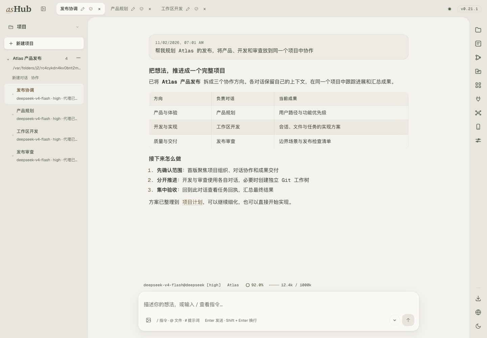
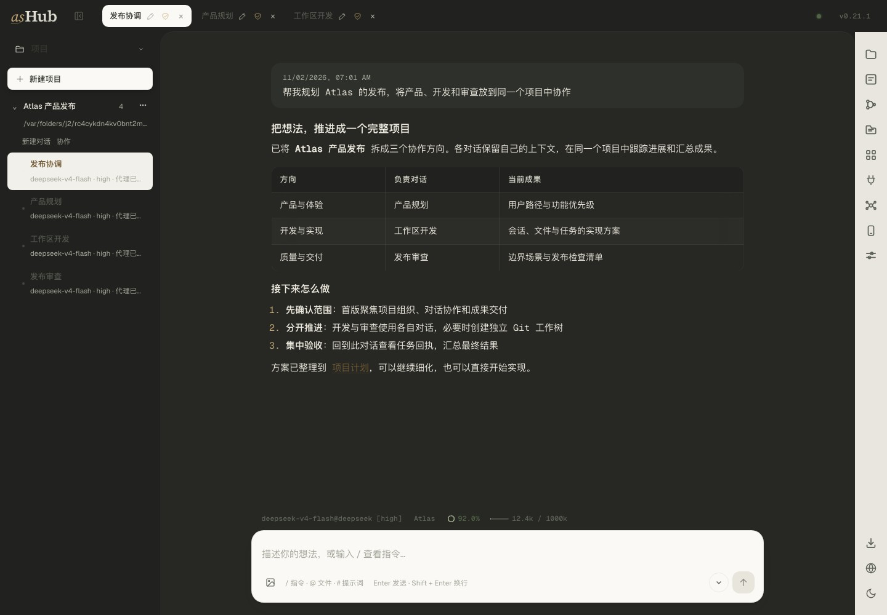
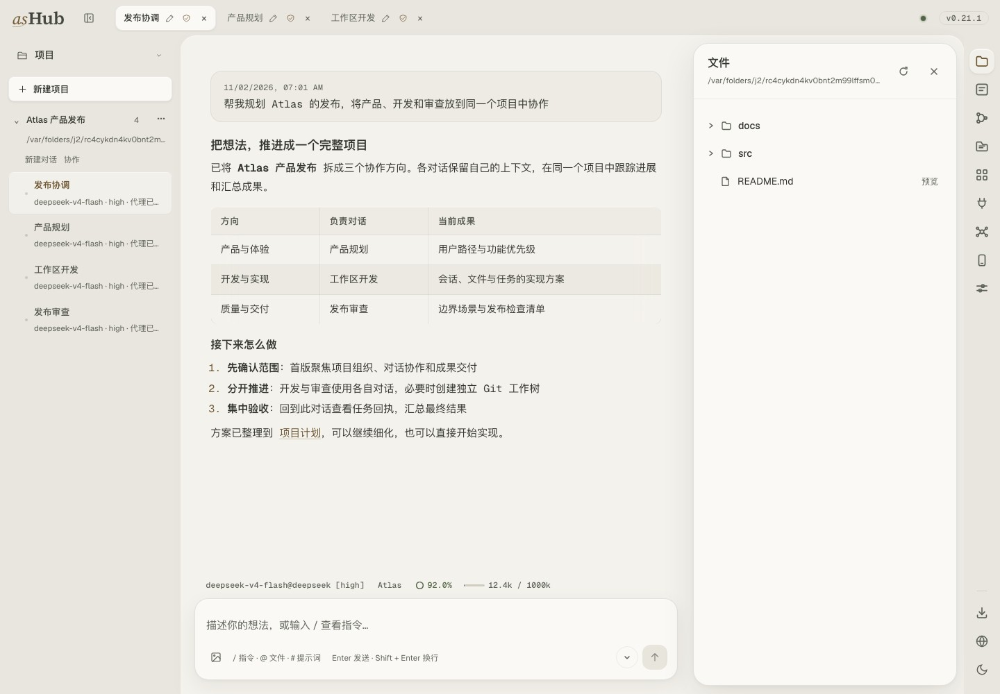

<p align="center"></p>
<h1 align="center">asHub</h1>
<p align="center">让想法成形，让复杂有序</p>
<p align="center"><a href="https://ashub.aihao.world">主页与下载</a> · <a href="https://github.com/firslov/asHub/releases">Releases</a> · <a href="README.md">English</a> · <a href="README_CN.md">简体中文</a></p>

[](LICENSE)
[](.nvmrc)
[](https://www.npmjs.com/package/agent-sh/v/0.17.0)

asHub 是基于 [agent-sh](https://github.com/guanyilun/agent-sh) 的开源桌面 AI Agent 工作台。把多会话、模型选择、子代理、终端和文件放在同一个界面，既能专注阅读结果，也能展开审阅完整执行过程。

支持 **macOS（Apple Silicon / Intel）、Windows x64 与 Linux x64**。桌面版与本地浏览器版使用同一套客户端；可使用自己的模型 API 凭据或受支持的 Codex 登录；计费及订阅额度以提供商为准。



*v0.21.1 中文工作台截图，使用隔离的演示数据。*

## 核心体验

**[v0.21.9](https://github.com/firslov/asHub/releases/tag/v0.21.9)** 将 agent-sh 内核升级至 0.17.0，并改进长任务、个人助手记忆和设备互联。

- **子代理：**实时界面和历史记录区分取消、部分完成和成功。遇到可重试的断流时，只重试当前模型请求，保留已完成的工具结果。同一会话中，成功或部分完成且仍有续跑记录的子代理，可沿用原任务、工具结果和原有权限继续。
- **个人助手：**授权原文可以和已有记忆一起检索，可为后台整理单独选择模型，也可试用带原文出处的项目决策概览。插件需单独安装。
- **设备互联：**可查看当前执行设备、返回设备列表；同步过久时，可以重新同步当前对话，保留草稿，不会自动重发消息。

| 能力 | 使用体验 |
| --- | --- |
| 会话与项目 | 在项目内直接新建和删除对话，会话按最近活动排序，支持搜索、置顶、归档与历史恢复 |
| 对话协作 | 在项目内派发任务、跟踪回执、补充已有任务，并向协调者报告阻塞；可选独立 Git 工作树隔离改动 |
| 清晰的执行过程 | 优先展示回复与进度，思考和工具输出收纳在可展开的详情中 |
| 任务与子代理 | 任务清单与进度；规划、探索、审查、调研、实现五类子代理，支持模型与预算配置 |
| 模型与上下文 | Codex 登录、模型搜索与原生思考等级，查看上下文和实际返回的缓存用量 |
| 可审阅的操作 | 权限审批、改动预览、会话级放行；后台完成与审批通知 |
| 项目工具 | PTY 终端、文件浏览、图片输入与技能市场 |
| 插件管理 | 启用随附扩展或导入可信 ZIP，统一配置、停用、卸载与恢复 |
| 后台运行 | 关闭窗口后保留任务与远控连接，从状态栏重新打开或退出 |
| 代理控制 | 全局设置默认代理使用方式，每个对话可单独覆盖 |
| 保留工作脉络 | 会话持久化、对话分支与回退、Markdown 导出及工作目录成果下载 |
| 统一的界面 | 暖白与石墨深色主题，中英文切换、显示缩放、可折叠状态栏 |
| 设备互联 · 预览 | 在另一台电脑或移动网页版继续已授权的对话 |

<details>
<summary>查看深色工作台</summary>



</details>

<details>
<summary>查看文件侧栏</summary>



</details>

## 安装与开始使用

从 [主页](https://ashub.aihao.world/#download) 或 [GitHub Releases](https://github.com/firslov/asHub/releases/latest) 下载。桌面安装包包含运行环境，无需单独安装 Node.js。

| 系统 | 安装包 |
| --- | --- |
| macOS Apple Silicon | `arm64.dmg` |
| macOS Intel | `x64.dmg` |
| Windows x64 | `Setup.exe` |
| Linux x64 | `.AppImage` |

1. 安装并打开 asHub
2. 在右侧配置面板设置模型提供商与默认模型，也可使用支持的 Codex 登录
3. 新建会话，选择项目目录，开始对话；需要时打开文件、终端或其他辅助面板

### macOS 一行安装

```sh
curl -fsSL https://raw.githubusercontent.com/firslov/asHub/main/install.sh | bash
```

脚本识别 Apple Silicon / Intel，将应用安装到 `/Applications` 并清除隔离标记。手动安装 DMG 如被拦截，可在「系统设置 → 隐私与安全性」中选择「仍要打开」，或执行：

```sh
/usr/bin/xattr -dr com.apple.quarantine "/Applications/asHub.app"
```

### Windows

使用 Bash 命令与 Git 工作树前，请安装 [Git for Windows](https://git-scm.com/download/win)。asHub 会自动识别标准安装及当前用户目录下的 Git。

### Linux

下载 AppImage 后，在文件所在目录执行：

```sh
chmod +x ./asHub-*.AppImage
./asHub-*.AppImage
```

## 设备互联与移动访问 · 预览

[asHub 移动网页版](https://ashub.aihao.world/mobile/) 可继续电脑上的对话。桌面端的[设备互联](examples/extensions/multi-machine)也支持从一台电脑打开另一台电脑的工作区。

1. 在负责执行任务的电脑上，通过「插件 → 本地扩展」启用「设备互联」。打开工具栏入口，选择「允许访问本机」，登录或注册账号并确认共享目录。从旧版「移动访问」升级会保留设备身份和授权。
2. 若显示恢复码，妥善保存后点击「恢复码已保存」。
3. 在手机上用同一账号登录，或在桌面端的「访问其他电脑」中登录，再选择目标电脑。登录查看其他设备不会自动共享本机。

目标电脑需联网、保持唤醒，且 asHub 正在运行。要在关闭窗口后继续访问，可开启「设置 → 后台运行 → 关闭窗口后继续运行」。退出应用或让电脑休眠仍可能中断连接。

远端只显示授权范围内且工作目录仍有效的对话。归档对话需先在桌面恢复。手机支持流式回复、授权的图片附件、模型切换和单次审批。同步用时过长时，可选择「重新同步此对话」；草稿会保留，待确认的发送会核对原回执，不会自动重发。移动访问和语音输入需要配套网关。中转服务不持久保存对话正文，连接不属于端到端加密。

## 插件

在「插件 → 本地扩展」启用随 asHub 安装的插件。首次安装默认关闭，已有手动安装的副本优先使用并保留原设置。卸载随附插件后，升级不会自动装回，可按需重新安装。其他插件可从可信来源导入 ZIP，详见[安装指南](docs/plugin-installation.md)。

| 提供方式 | 插件 |
| --- | --- |
| 随 macOS、Windows、Linux 版提供 | [Kimi Coding Plan](examples/extensions/kimi-coding-plan)、[项目管理](examples/extensions/project-management)、[会话浏览器](examples/extensions/browser-automation)、[图文展示](examples/extensions/image-display)、[设备互联](examples/extensions/multi-machine)、[定时任务](examples/extensions/scheduled-tasks)、[语音输入](examples/extensions/voice-input) |
| 仅随 macOS 版提供 | [桌面控制](examples/extensions/desktop-control) |
| 单独安装 | [个人助手](examples/extensions/personal-assistant) |

[微信机器人](examples/extensions/wechat-bot)是单独的 agent-sh 扩展示例，按它自己的说明安装。

- **个人助手：**左侧入口打开专属对话。经授权后，只从这段对话整理和召回记忆，也可纠正、遗忘或暂停记忆。首次创建与授权在桌面完成；共享助手工作目录后，手机可继续同一段对话。
- **项目管理：**派发或补充任务，跟踪投递与阻塞，在成员交付后接续获授权的流程。用户停止和工具审批仍然有效。
- **会话浏览器与图文展示：**在 Electron 桌面版的对话旁打开网页，按对话和站点隔离登录，支持文件上传和下载审阅。图文展示提供已授权图片的行内预览。下载确认与持续授权仍需在桌面完成。
- **定时任务与语音输入：**电脑唤醒且 asHub 运行时，可向已有对话单次或定期提交消息。语音转写写入可编辑草稿，由你发送。可使用 asHub 的免费共享额度，或自行配置转写服务。
- **桌面控制：**需要 macOS 14+ 和 Python 3.12+。启用后在新对话中运行 `/desktop install`，并按需授予系统权限。
- **Kimi Coding Plan：**使用 `/kimi-login` 完成 Kimi 网页登录。

## 从源码运行

从源码运行推荐使用 **Node.js 22 或 24**（`.nvmrc` 固定为 **22.23.3**）。CLI 要求 `>=22.12.0 <26`；由于当前代理配置与 Node.js 26 不兼容，CLI 会拒绝在 Node.js 26 及以上版本启动。此限制不影响自带运行环境的 Electron 桌面版。

项目固定使用官方 npm 发行版 **agent-sh 0.17.0**。安装时会检查 Windows Codex 登录代码并应用仍需保留的提供商和重试兼容补丁。使用 nvm 时：

```sh
git clone https://github.com/firslov/asHub.git
cd asHub
nvm install && nvm use
npm ci
npm run electron:dev
```

只运行本地 Web 服务：

```sh
npm start -- --port 7878
# 浏览器打开 http://localhost:7878
```

### 跨设备访问

```sh
npm start -- --host 0.0.0.0 --port 7878
```

默认仅监听 `127.0.0.1`。非回环地址需要访问令牌：启动时终端会显示自动生成的令牌，在浏览器 `/auth` 页面登录。也可通过 `ASHUB_TOKEN` 设置固定令牌；API 客户端使用 `Authorization: Bearer <令牌>`。跨设备连接请使用可信网络或 HTTPS 反向代理。

会话历史保存在本地；使用云端模型时，相关请求内容会发送给配置的提供商。ACP 会话恢复依赖后端的 `session/load`：不支持恢复或旧会话缺少远端 ID 时，历史仍可查看，但需新建会话继续。

## 工作原理

`src/hub.ts` 是核心：一个**与后端无关**的 HTTP + SSE 服务，为每个会话创建并监管一个 *bridge*。
负责对话的那一端只需发出 `BusEvent` 并实现 `submit` / `cancel` / `close` —— 接口定义见
[`src/bridges/types.ts`](src/bridges/types.ts)。

```
Electron 外壳 (electron/main.cjs)           浏览器（任意现代浏览器）
        │                                             │
        └──────────────► hub (src/hub.ts) ◄───────────┘
                     单一 HTTP 端口，路径路由 /<id>/events、/<id>/submit
                                 │
        ┌────────────────────────┼────────────────────────┐
        ▼                        ▼                        ▼
   AshBridge               AcpBridge               TerminalBridge
   进程内 agent-sh 内核     子进程（ACP 协议）        PTY shell（node-pty）
```

| Bridge | 运行内容 | 选择方式 |
|---|---|---|
| `AshBridge` | 进程内直接跑 agent-sh 内核，无子进程，少一跳 | 默认（`--backend ash`） |
| `AcpBridge` | 说 ACP 协议的子进程，如 `agent-sh-acp`、`claude-code-acp` | `--backend acp [--cmd "CMD ARGS"]` |
| `TerminalBridge` | PTY shell 会话（agent-sh 的 shell 或普通终端） | 会话类型 `terminal` |

因此新增一种后端只需要实现一个接口，hub、SSE 协议与前端都不用改。

## 命令行参数

以下参数适用于 `ashub` / `npm start`；Electron 应用以默认值在进程内启动同一个 hub。

| 参数 | 默认值 | 说明 |
|---|---|---|
| `--backend ash\|acp` | `ash` | 桥接实现：进程内 agent-sh 内核，或 ACP 子进程 |
| `--cmd "CMD ARGS"` | `agent-sh-acp` | `--backend acp` 时启动的子进程命令（支持双引号） |
| `--port N` | `7878` | HTTP 端口 |
| `--host HOST` | `127.0.0.1` | 绑定地址 |
| `--web PATH` | `./web` | 静态资源根目录 |
| `--model NAME` | 配置默认值 | 覆盖模型（ash 后端） |
| `--provider NAME` | 配置默认值 | 覆盖 Provider（ash 后端） |
| `-h`, `--help` | — | 显示帮助 |

```sh
# 进程内内核（默认）
ashub --port 8080

# 改为拉起 Claude Code 的 ACP 服务
ashub --backend acp --cmd "claude-code-acp"
```

## 项目结构

```text
src/                  HTTP/SSE 服务、会话生命周期、历史与权限
  bridges/            agent-sh / ACP / PTY 桥接实现
  history/            历史存储、帧捕获与上下文压缩
web/                  原生 ES 模块与 CSS，无前端构建步骤
  js/stream/          思考、工具、任务、正文与实时输出渲染
  assets/brand/       统一的图标、标志与矢量字标
electron/             桌面窗口、IPC、自动更新与应用图标
website/              主页、下载模板、字体与应用配图
scripts/              构建辅助与演示配图截取
tests/                隔离回归、HTTP 与内核兼容测试
examples/extensions/  扩展示例
```

## 开发与验证

| 命令 | 作用 |
| --- | --- |
| `npm run check:core` | 构建、类型检查与完整核心回归 |
| `npm run build` | 编译后端 TypeScript 至 `dist/` |
| `npm run typecheck` | 后端类型检查 |
| `npm run typecheck:web` | 前端工程检查 |
| `npm test` | 隔离回归测试 |
| `npm run test:http` | HTTP 与会话接口测试 |
| `npm run test:kernel` | 构建并检查内核及 Codex 兼容性 |
| `npm run test:network` | 代理与网络行为测试 |
| `npm run test:worktrees` | 独立 Git 工作树测试 |
| `npm run electron:pack` | 生成解包应用 |
| `npm run electron:dist:mac` | 构建 macOS 安装包 |
| `npm run electron:dist:win` | 构建 Windows 安装包 |

Electron 加载编译后的 `dist/`，CLI 通过 `tsx` 运行源码。前端第三方库随仓库提供，界面资源无需外部 CDN。回归测试使用临时数据与模拟边界，不调用模型，也不读取实际配置密钥。

技能可从内置市场安装；扩展从 `~/.agent-sh/extensions/` 加载，支持 TypeScript。参见 [扩展示例](examples/extensions/wechat-bot)。HTTP 路由实现参见 [`src/hub.ts`](src/hub.ts)，后端接入契约参见 [`src/bridges/types.ts`](src/bridges/types.ts)。

## 许可证

[MIT](LICENSE)
